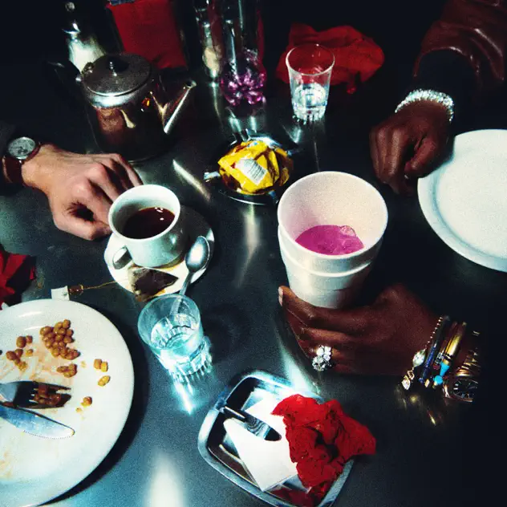

## *Bad Cameo* (James Blunt & Lil Yachty, 2024)

  
([Apple Music](https://music.apple.com/ca/album/bad-cameo/1751980321), [YouTube Music](https://music.youtube.com/playlist?list=OLAK5uy_kSSRux00S_9ZQIUzlYht29cMvHK5WCtUk))

#### Mary

And I thought I’d choose ‘Bad Cameo’ by James Blake and L’il Yachty for the next fortnight. I thought I’d choose something super-produced as we’ve been listening so far to quite simply produced music. And from what I have heard so far Bad Cameo is a mix of electronic sounds, anthem rock (?) and some rap too. The only thing I know about James Blake is that he’s a mega producer and about L’il Yachty is that our friends in Sydney did not expect us to have heard of him (thank you Pippin for some Aussie cred).

<iframe width="560" height="315" src="https://www.youtube.com/embed/jPHhmABR0ew?si=5b55LQq1QZ0U7vWA" title="YouTube video player" frameborder="0" allow="accelerometer; autoplay; clipboard-write; encrypted-media; gyroscope; picture-in-picture; web-share" referrerpolicy="strict-origin-when-cross-origin" allowfullscreen></iframe>

And the great first comment: who is this beardless man child playing steel guitar and sounding just like Willie?

#### Pippin

Okay I’ve listened to Bad Cameo about three or four times now - most recently with close attention on a supermarket run.

I like it, Rilla liked when she heard it from upstairs. I think some of the lyrics really stand out, the hip hop style of word play, maybe especially on the first track? The various money flexes are so creative.

But somehow I think it’s so slick a lot of the time it’s almost hard to listen to closely? Think it would be amazing live…

I was wondering about the idea of post modernism in music a bit, or at least the idea of music that reveals its production in some way? Jazz obviously, but maybe Carol King too through the “thinness”? Whereas this maybe not?

#### Jim

Carol King is everywhere. I was looking at Kehinde Wiley’s website earlier this morning and saw they didn’t have a pic of his Times Square work ‘Rumors of War’. I chased up one I had taken to put up on the site and saw this poster for ‘Beautiful’ a Carol King musical! 

#### Mary

Another diversion from ‘Bad Cameo’ …  
Now that we’re at the end of the Film Festival, we thought it might be interesting to look back at it through a music /sound lens. Although we’ve noticed music before, of course, thanks to ‘A year of music’ this time, we paid closer attention and what we understood better was the distinction between the soundtrack and the sound design.
 
Grand Tour directed by Miguel Gomes played with music (and everything else winning best director at Cannes this year). Most arresting was when the Blue Danube boomed out to accompany scooters in Saigon diving around the traffic, and yes, it was waltz-like. There’s also (again in Saigon) a scene where a noodle eater gets up and sings his version of ‘My way’ and of course there is the Bobby Darin song we mentioned earlier. A lot of music woven together with complex visuals, different times … it’s amazing
 
Soundtrack to a coup d’état is a documentary about the Democratic Republic of the Congo and what happened as their independence struggle culminated in the murder of Prime Minister Patrice Lumumba. It’s a terrible story and the historical footage and use of official documents and interviews is outstanding. Unfortunately, the hook chosen to structure the movie is … music!! Specifically American jazz of the 1950s and 1960s, so all the greats are. Although the CIA and American diplomats used jazz as propaganda (yes, Dizzy Gillespie, Louie Armstrong), the link sometimes feels stretched but more importantly the music is presented in brief snippets only so it feels manipulated. Great doco apart from how it uses the music.  
 
Days of heaven from Terrence Malik delivered again and while the visuals are spectacular the music is a classic too. Starts with Saint-Saens’s Carnival of the animals over the credits, setting the scene for America in 1916 and then we get Ennio Morricone scoring the rest with his memorable brand of emotion and drama. One weirdness is that because we know the spaghetti westerns better, the music reminded us of Sergio Leone.
 
Then there was Paris, Texas as another visit. We hadn’t remembered the plot v well (where did that child come from ??) and Ry Cooder’s soundtrack is so memorable and been used so often that it felt a touch controlling.
 
‘I saw the TV glow’ by Jane Schoenbrun was definitely not our film except, except one track by Caroline Pooched and a performance of ‘Claw machine’ by Phoebe Bridgers and a kind of erotic feminist punk band (is there such a thing?). The central character is transfixed, so were we.
 
And ‘The village next to paradise’ dir by Mo Harawe. We went partly because it was made in Somalia but we liked its family-struggles story and non-actor actors. The soundtrack featured drones and explosions plus the Ethiopian piano playing nun Elmahdy Tsegue Maryam Guebrun (yes, we had to look up her name but we’ve listened to her a lot) which startled us and fitted so wonderfully with that precise clear sound.

