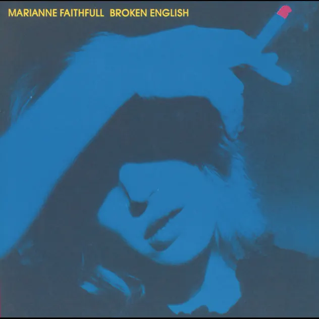

## *Broken English* (Marianne Faithful, 1979)

  
([Apple Music](https://music.apple.com/us/album/broken-english/1443851809), [YouTube Music](https://music.youtube.com/playlist?list=OLAK5uy_nzmUu1z_h2ACb_mqWhm6FyG7zCzCK87d0))
 
### Jim

My turn comes when there is really only one choice available. Broken English was such a market in our time. How many times did we play it, over and over again. That voice ravaged by her life was like the end of an era. Oh, oh…. Here come the Eighties.

### Pippin

Damn. I was familiar with Broken English and of course the Ballad of Lucy Jordon. And then … Why’d Ya Do It played and I was half doing something else and then the lyrics really uh… broke through. So many kind of incredibly intense things in the lyrics that all accumulate into a pretty awesome use of language?

> "Why'd ya do it", she screamed, after all we said
> Every time I see your dick, I see her cunt in my bed

And so much more. Kind of… cool? Feels to me like a combination of rawness and almost comedy(?) that I appreciate. When I just read the lyrics it also almost has this mythological sense to it as well. Like a really insane Aesop’s fable?? 

> When I stole a twig from our little nest
> And gave it to a bird with nothing in her beak
> I had my balls and my brains put into a vice
> And twisted around for a whole fucking week

Anyway it sure is a striking track.

### Jim

The lack of today’s high-end production certainly gives it a rawness even without the lyrics. A lot of artists are trying to rediscover this more ’honest’? sound now. At home Merylyn attempted the same thing with her 16ml films.

### Mary

Marianne Faithfull, Broken English, 1979

So, first up I was very surprised at how late this album was: your birth year Pippin. I would have thought it was earlier – which says more about my interests than Marianne’s of course.

I had started watching her in Godard’s ‘Made in U.S.A.’ when I heard she had died and it was a great choice! It’s made in 1965, she’s so young (around 18) and she holds that song while those about her have their minds on something else. 

[https://www.openculture.com/2025/01/jean-luc-godard-shoots-marianne-faithfull-rip-singing-as-tears-go-by-in-1966.html](https://www.openculture.com/2025/01/jean-luc-godard-shoots-marianne-faithfull-rip-singing-as-tears-go-by-in-1966.html)
 
And then Jim chose BE so I followed. 

This album has in many ways turned into a monument to us boomers rather than having new life as music. It is just so profoundly familiar. When I (finally) sat down and listened through it, the musicianship was arresting as usual to me, it is so ‘made’ and her musicians are serious players with serious arrangers and studio guys too. I really liked hearing that side of it for the first time. 

‘The ballad of LJ” is always a sentimental favourite but in the context of the album it doesn’t dominate, in fact it is a touch out of place because it sounds so sweet (Ignoring the story of mental illness and suicide of course). It really is a ballad (doh) with a clear narrative line. I suspect it was all us women in our 30s hoping we had time to drive around Paris in a sportscar who imbued it with magic. The coolest thing of course was that we knew that Marianne certainly had! The end of the ballad is particularly good. It could have touched melodrama but instead it just quietly, stops.

To me her performances, once you settle down with ‘the voice’, is all about the phrasing. She is really good at hitting the mark between talk phrasing and singing phrasing. 

The diversity of the album was a surprise to me – from the sweet musicality of The ballad of Lucy Jordan’ to the curdled relentlessness of ‘Why’d you do it’ to the topicality of ‘Broken English (ok, I confess, I never knew it was about Baader Meinhof) to the class rant via John Lennon of ‘Working class hero’ (although that drips irony when delivered by the daughter of a Baron). It holds together because the steps are all so familiar, although it’s not really a classic studio album which are (in my small experience) more phased. Still, it works.

Finally, an anecdote I can’t resist. Jagger is at her bedside as she is waking up from an overdose. ‘Marianne, we thought we’d lost you!’ She replied, ‘Wild horses wouldn’t drag me away’.

### Pippin

Woo! Classic Mary and some great stuff in there. Did not know many of these facts which for sure shift things in listening (especially the barony???)

