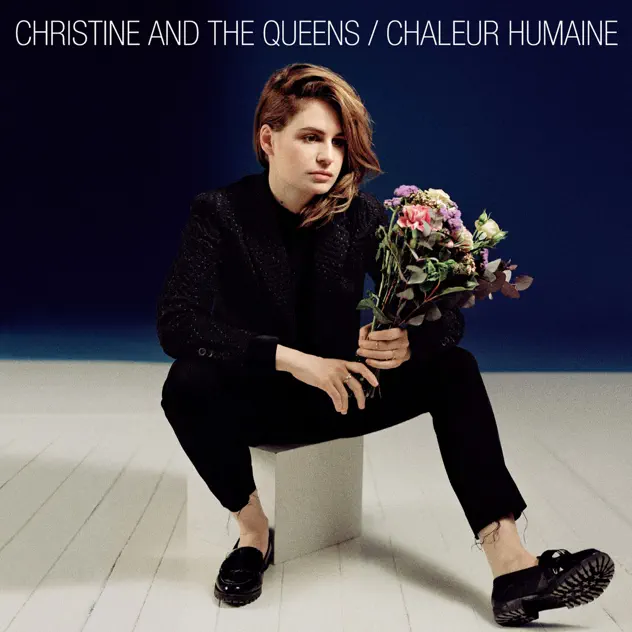

## *Chaleur Humaine* (Christine and the Queens, 2014)

  
([Apple Music](https://music.apple.com/us/album/chaleur-humaine/1325689459), [YouTube Music](https://music.youtube.com/playlist?list=OLAK5uy_ki826t1L7btmcFlU0UP0fU5NPVLJ45GiE))

#### Jim

OK this album by Christine and the Queens is now 10 years old but recently we have played it over and over. Just can’t get enough of the way it sounds and slips in and out of French. The slippage reflects the start of Christine’s rocky road transitioning into the performer known as Rahim Redcar. Hope you love it as much as we do…let the wild rumpus begin….

#### Pippin

This is all new to me! Redcar is clearly a massive force in French music and culture, and internationally too… but never heard of him!

Been listening in fits and starts, feels more like summer music so the cold weather is cramping its style for me a little.

Main observation for this moment as I rode the bus to work is about the percussion. Very drum machine and really stands out in my personal attention when listening. This is definitely because Felix and I have been playing with a bunch of music making tools of late (nanoloop and Koala on the phone), but now especially as we’re trying to decipher a CD “pocket operator 32” which is essentially a tiny drum machine.

Playing with this stuff really sensitized my ear to drum rhythms, and more and more the way producers change the timbre, reverb, and other qualities to create specific backgrounds to the voice. I can’t help counting beats and imagining how it’s being programmed, which is fun!

This album has very purposefully simple drum stuff, but a lot of play with the parameters within that I feel like.

#### Jim

Interesting how you call this Summer music. Easy to forget how the seasons affect our spirits and ways of looking and hearing. It happens with art too. One of the big contexts I guess.

[https://www.washingtonpost.com/entertainment/music/2024/11/15/shel-talmy-dead-appreciation/](https://www.washingtonpost.com/entertainment/music/2024/11/15/shel-talmy-dead-appreciation/)

#### Pippin

<audio src="../assets/music/how-it-is.m4a">

Amazes me a know-nothing like me can casually make this in 10 minutes. The whole world of drum machines and sequencing is ridiculous.

#### Mary

And, it even did stereo in my hearings aids!! It’s all pattern languages that somehow talk to each other and layer over each other. You know-nothings can be surprising 

#### Jim

Definitely not to be snared at.

#### Mary

[“More music is being released today (in a single day) than was released in the calendar year of 1989”: How the music production industry has taken note of the huge number of self-releasing artists](https://www.musicradar.com/music-industry/more-music-is-being-released-today-in-a-single-day-than-was-released-in-the-calendar-year-of-1989-how-the-music-production-industry-has-taken-note-of-the-huge-number-of-self-releasing-artists)

Burst of creativity/ engame? You decide

#### Pippin

Do we need a musical Thanos to turn half of all music producers into ash… hard to say…

#### Mary

We have been out of the loop! I see I have not yet responded to Christine / Redcar and I love this stuff. I am onto it tomorrow for sure. And listening to SO SNER and via their website the ‘wilder territories of organised sound’. I like the quiet detail. I will venture further …

And wait! I see one of them has performed with ‘ fine art luminary Katharina Grosse.’ Such words!

#### Pippin

(Oh good, yes let’s get back on this horse!)

#### Mary

And, jim noted I should also have mentioned that Katharine is a friend of ours. She lives in Germany and NZ. Connections, connections

#### Mary

Chaleur humaine 2014  
Rahim Redcar  
Formerly  Christine and the Queens  
 
We have thrashed this album over the last few years. It was released in 2014 but we didn’t find it until quite some time after that. And then we found some videos (especially of ‘Tilted’) and then Christine became Rahim Redcar and we listened to some of that and then she turned up at the opening of the Paris ParaOlympics in a glorious red suit. For a Year of Music I followed the video trail  further and there she was in a bolero jacket walking through an abandoned town with people peeking at her and then she’s walking alongside a big black bull. 
 
Usually she is dancing (Michael Jackson refs)as in ‘Tilted’ (the most famous song?) although ‘Paradis perdu’ would have to be up there. We never understood that the repeated lyric was in fact in English: ‘Heartless”. It’s one of the great things you get from different languages: errors, misinterpretations, odd intonations. The version when she is sitting in a chair in a beautiful pink suit is pretty great.  She dances on a riverbank in ‘It’s ok to cry (hôtel for SOPHIE’) and I wonder if that was for SOPHIE (often iin upper case) the producer and DJ who died a few years back. Also
 
Rahim  
[https://www.youtube.com/watch?v=fUWpD93wQaY](https://www.youtube.com/watch?v=fUWpD93wQaY)
 
Sophie  
[https://www.youtube.com/watch?v=m_S0qCeA-pc](https://www.youtube.com/watch?v=m_S0qCeA-pc)

And then there’s SOPHIE. Check out Sophie’s ‘It’s okay to cry’ by Rahim and then by SOPHIE herself

Rahim
[https://www.youtube.com/watch?v=fUWpD93wQaY](https://www.youtube.com/watch?v=fUWpD93wQaY)
 
Sophie
[https://www.youtube.com/watch?v=m_S0qCeA-pc](https://www.youtube.com/watch?v=m_S0qCeA-pc)

SOPHIE was so hardcore. 

A bit of confusion there, but I arrived at my conclusion!!