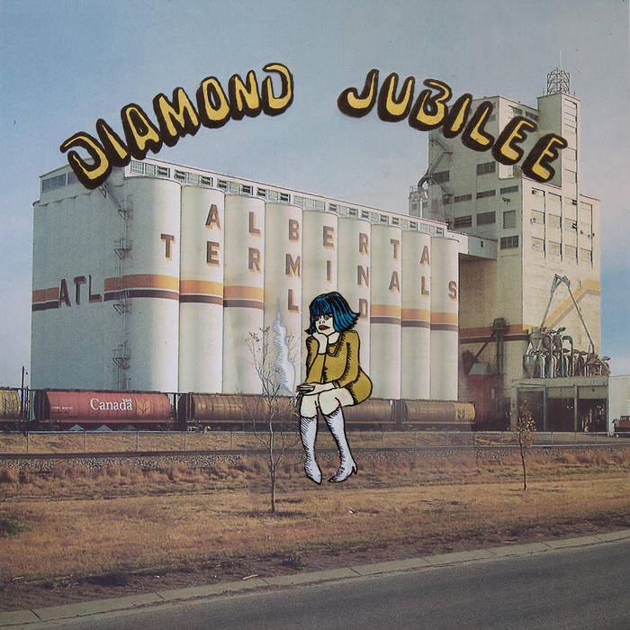

## *Diamond Jubilee* (Cindy Lee, 2024)

  
([Bandcamp](https://cindylee.bandcamp.com/album/diamond-jubilee))
 
### Mary

My pick that I am going to make before we head off to social Auckland (where I also get to ask people for music ideas). For now I’m going for Cindy Lee, Diamond Jubilee. It’s 2 hours long and I haven’t listened to it all but it feels like a contemporary anthology wrapped in nostalgia and strange sounds. Am I going to like it after a few weeks? We shall see. Oh, they are Canadian (and I hope you have already suggested it to me, Pippin….)

### Pippin

Heh, I don’t recall if I recommended it your way but I do really like it. Listened to it a lot in December. Only on bandcamp! Excellent choice.

### Pippin

Meant to say, too, that I find it kind of special when an album is *not* available via streaming like this. It probably only works when it’s uncommon, but it’s such a harking back to a different era of listening to music, seeking out a specific album at the store, finding it, buying it, etc. Working for it a little bit more, putting some faith into it.

And the album itself I find pretty wonderful. I remember drifting in and out of consciousness (in a good way) on the plane from Montréal to London listening to the whole thing and finding that a strangely great way to hear it; fits the dreamy quality it has, all washy.

### Pippin

Small note on Diamond Jubilee from recent listens: really notable panning at various points that I very much didn’t pick up on speakers. I feel gross using the word “textural” but here we are.

### Mary

Diamond Jubilee is proving a favourite here. Its strength (diversity) makes it hard to form an opinion of the whole, esp as the download we have from YT doesn’t have separate tracks titled! It’s rather weird though to have two hours of v differentiated music with no way to identify what you’re listening to …. And, oh yes, the lyrics are not there either. Yikes!

### Jim

I’m enjoying it although it feels a bit earnest at times…then it turns around and delights you. What’s not to like in that sort of mix.

### Mary

I think we have now listened to this album 3 times and yes we love it and yes we have no specific remarks as we have no ref points so we’re at pop history sounds, lots of production, great voice, great vocals. Unsatisfactory but there we go

Ok idiot I have the lyrics and track list….

I am the idiot I mean!

### Pippin

Yeah I tend to agree, it feels kind of monolithic in a way (especially when it’s a single track!). Happy to move along, have really enjoyed it.

