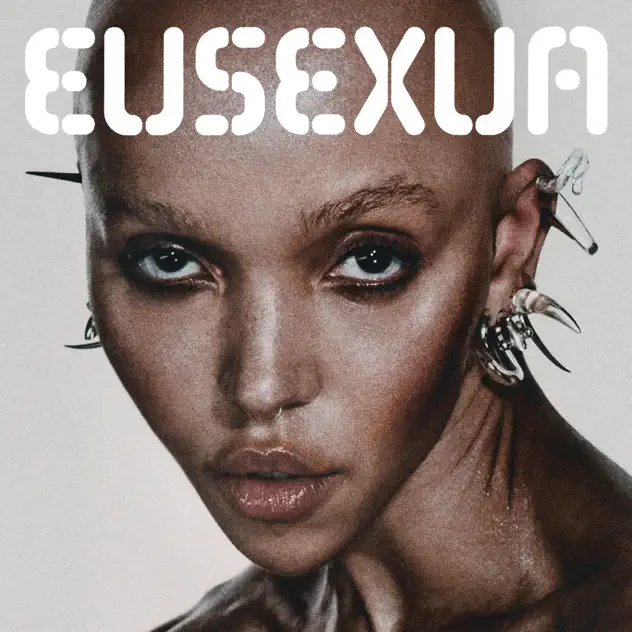

## *EUSEXUA* (FKA twigs, 2025)

  
([Apple Music](https://music.apple.com/us/album/eusexua/1767658574), [YouTube Music](https://music.youtube.com/playlist?list=OLAK5uy_nQ6rNoZY6JEoZ493vscP8ZlKgk8ddL-hQ))
 
### Pippin

Pivoting to Rilla’s pick to keep us rolling: FKA twigs’ EUSEXUA

### Mary

Looking forward to listening 

### Pippin

It’s very good. I have vivid memories of listening to the entire album standing out at the hotel shuttle pickup zone of O’Hare, freezing my ass off and paying close attention to the music to take my mind off it.

Listened through it again today. Many reference points different tracks, Madonna early on (Ray of Light era), Robyn for sure, Björk even. Even vaguely a moment of thinking about Tarta Relena?

Really enjoy the production throughout. Some of the broken up voice stuff is great.

### Rilla

Please take the time to check out the videos. She has epic presence - befitting of her sound.

### Pippin

🫡

I also liked this recent interview

[https://www.theguardian.com/music/2025/mar/26/fka-twigs-social-media-censorship-sexuality-crying-magical-childhood](https://www.theguardian.com/music/2025/mar/26/fka-twigs-social-media-censorship-sexuality-crying-magical-childhood)

Speaking of presence!

### Rilla

And it legit looks like her body CAN do anything.

### Pippin

💯

### Rilla

And on that note,  we had dinner last night with Michael and Samuel. They went to one of her shows, yes, they are fans, but they said it was not great. The videos they said to us: watch the videos!!

### Mary

I spent some time listening to Eusexua yesterday (on headphones) and it was amazing, of course. More to come but what a great choice and the videos are unreal, literally. Yikes, girl power,

### Rilla

THE VIDEOS MARY!!!

### Mary

FKA Twigs Eusexua
 
What an album! An incredible artist although I see she has just had to cancel her USA tour because of ‘visa issues.’ Plus, fun fact from earlier this year, she has never had a pop chart hit in any territory besides NZ!! What’s everyone else thinking?? 
 
I was stunned by the videos of course, the high style, the trickery, the alienness (plus I loved the sword fighting one from a different album); the eye watering choreography and the new physical possibilities/ impossibilities it brings; the kind of Berlin Berghain vibe (not that we ever went through that door), this is dance music after all; the humour, especially Perfect Stranger and her cooking effort; the energy; many of the lyrics ‘I’d rather know nothing than all the lies’ and ‘Just give me the person you are tonight’ and ‘Hello it’s your life, and you’re my main character’ plus brilliant use of repetition e.g. in Wanderlust and ‘right there if you need me’ many times; and there’s that voice of course, manipulated, glitched, soaring, whatever she wants plus stunning musical support
 
In the wider world I got a few glimpses into her dramatic personal life but I was wowed by her presentation on AI to Congress. I was very impressed also by the scale of her enterprise. She must be a brilliant collaborator to have so many people want to work with her (yes, Phoebe, you do come to mind). It’s the age old thing having ideas is one thing, executing them with so much style and conviction is quite another. 
 
As Kevin Robets once said ‘Chapeau! Chapeau!’

She said it herself: “I’ve got supersonic powers.” Indeed

Plus I see she is sponsored by ON shoes and I have two pairs. Yes, I am a fan!

### Pippin

Great research here too! Had no idea about the congress thing, will have to look it up!

I haven’t listened for a bit as I ended up getting saturated by listening *so often* over the start of 2025. So many things to like about it and I *still* haven’t even got to the videos yet.

### Jim

I should write something but listening to her is like being in a dream.

### Pippin

That’ll work!

Case closed perhaps?

