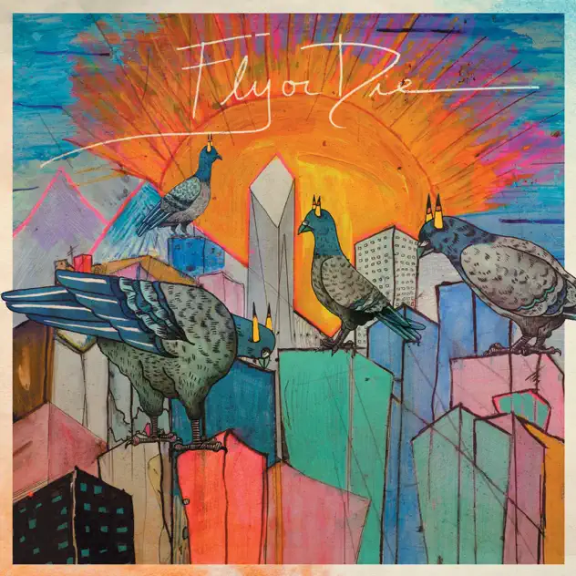

## *Fly or Die* (Jamie Branch, 2017)

  
([Apple Music](https://music.apple.com/ca/album/fly-or-die/1215029587), [YouTube Music](https://music.youtube.com/playlist?list=OLAK5uy_lpGlNV1rGjbzegcb6G7blztWPE0m6g0kw))

#### Pippin

> Well here's the first album selection: *Fly or Die* by Jamie Branch, from 2017. I currently cannot for the life of me remember how I heard about it. I can see I recommended it to Matt last year.

> Anyway, it's a sort of uptempo jazz, a bit funky? I lack the language for this right now but there are ways in which it doesn't totally sound like what I think of as jazz, but it also totally does.

> Jamie Branch was a trumpeter, nicknamed "Breezy." She died in 2022, age 39, of a drug overdose. 

> There is also a live version of this album and a sequel: *Fly or Die 2*. Haven't listened to either as yet.

> Apple Music: <https://music.apple.com/ca/album/fly-or-die/1215029587>  
> YouTube Music: <https://music.youtube.com/playlist?list=OLAK5uy_lpGlNV1rGjbzegcb6G7blztWPE0m6g0kw>  
> Pitchfork obituary: <https://pitchfork.com/news/jaimie-branch-jazz-composer-and-trumpeter-dies-at-39/>

#### Mary

We were listening to Fly or Die this evening (courtesy of Pippin) and the connections to movie music sounded very real. I find it hard to remember music and I’m always asking what an album or a track are (I default to the names and titles instead) but I think it’s the variety of the tracks on this album that is really impressive to me. And having read a little about her bio, the sense of her being with these diverse musicians in the same place and making such varied sounds. I haven’t yet got a sense of whether it sounds like a single album so it’s particular sounds that cut through and tonight, tonight it was with the movies.

#### Jim

I agree about the movie theme effects. I enjoy this music most when she is taking the lead. Find the more abstract passages a bit…well…abstract particularly when joined by the crescendo violins. But have to say something that’s not really to my natural taste has caught on to be very likeable.

Just read a fellow musician who played with her saying how funny Jamie Branch was. He described her as, “my brain is pink slime choking on air dying of laughter funny.”

#### Pippin

It is a pretty diverse album - starts out accessible, I think, well especially track two (Theme 001) and gets into some more abrasive/abstract stuff later on (The Storm?). I feel like thinking of it in terms of scoring a film is pretty helpful - it does seem like the different tracks are evoking some kind of scene or situation, and the titling does suggest cinema a bit? (Alison?) Theme 001, Theme 002, ... funny how the numbers suggest the potential for like a thousand of them.

I hardly ever think about song titling but it’s something I always mean to pay more attention to. Definite suggestions of a specific journey here? You “Jump Off” and eventually end up “… Back at the Ranch”… I don’t want to get too Peter and the Wolf on it, but this whole thing could be a story?

And that makes me think about the album title and cover… is this a story about being a pigeon? Dare I dream it?

Oh, I wanted to add relative to that “funny” thing - when we were at Minton’s seeing the Miles Lennox Trio there were all these moments where the musicians were so clearly talking to each other through their instruments, including making musical jokes - as in, it was obvious enough that even I could see it as a non-musician. You’d see the pianist do something, and then the saxophonist (who was not playing, just listening intently) would laugh! A very jazz thing, I’d think…

#### Mary

So today I listened to the full album Fly or die in one session. And I listened rather than turned it on and went off to do something else. Perhaps this is the first time I have done this for … years? A very different experience of an album as I started to catch themes and connections within the tracks and across them. What really struck me was how she uses the breaks between tracks as pacing: sometimes we slide across tracks, sometimes there is a distinct break. I had to keep an eye on the track titles to recall where I was. The varied roles of the trumpet stood out - from central force to pacer to colleague - and the v different sounds. I realise I don’t have a lot of vocabulary to describe different instruments or sounds. Let’s hope I have more by July 2025! I very much liked the track ‘Meanwhile’ becos of the strange experimental sounds also the next track Theme 002 with that wah-wah trumpet although here I found the dialogue among the instruments less interesting, but I loved ‘Leaves of glass’ (great title) with the filmic treatment of the 002 theme and then there’s ‘Storm’ featuring Ben LaMar Gay. This was a favourite track today. Crackly watery sounds and sliding around the notes with less assurance, more questions, more echoes. And then it felt as the sound was being carved out at different levels with everything held back, restrained. And from here on I felt the tracks picked up on this form and were all more questions than statements, more buzzing and vibrations, more levels, no foreground/ background, everything in sync. Wow. And the final kicker, the spoken ‘meanwhile, back at the ranch ..’ followed by some great guitar. What an experience for a warm Wednesday afternoon in Montreal!

#### Jim

for the full experience this is well worth a watch.

<iframe width="560" height="315" src="https://www.youtube.com/embed/deLvHbZEmuA?si=8WvH1_-xLRR-_x_w" title="YouTube video player" frameborder="0" allow="accelerometer; autoplay; clipboard-write; encrypted-media; gyroscope; picture-in-picture; web-share" referrerpolicy="strict-origin-when-cross-origin" allowfullscreen></iframe>

#### Pippin

A week later: So great to see that video - really gets at what I felt was the core of enjoying the live music at Minton’s in Harlem, that you can see the musicians relating to each other. There’s a great sequences around 8 minutes where the bass and cello are playing and watching each other, the bassist keeps smiling; and then later during an extended drum solo again you can see the cellist shaking their head, the bassist with a huge smile… these things that kind of confirm “yes, this is amazing!” It feels both like an inaccessible knowledge - it all sounds pretty virtuosic to me and I don’t really get *what* is specifically amazing - but also it feels inclusive, people letting their feelings show in the moment and sharing them along with the music. Feels like jazz is kind of the perfect expression of this stuff?

Separately: I keep wondering how a trumpet actually *works*. It only has three buttons! Rilla mentioned that there’s a lot of nuance going on through the way your blow into it, but wow… it seems like such a weird instrument, so simple but clearly so expressive. And who the hell worked out you introduce all these curves and that’s what comes out the other end?

#### Mary

And I have just watched part 1 of the JB video. A revelation to me of how some of the sounds were being made. I was not expecting a cello! And then when she plays with the water in the trumpet I laughed out loud. So unexpected. I figured there would nods and smiles among the players but that water! Also I had no idea about much the trumpet can do. This was like a listening class for me

