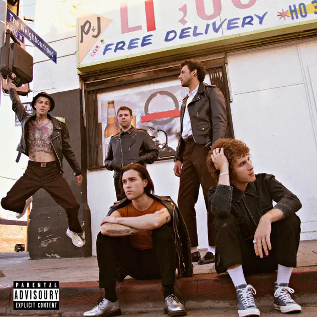

## *Hard to Imagine the Neighbourhood Ever Changing* (The Neighbourhood, 2018)

  
([Apple Music](https://music.apple.com/us/album/hard-to-imagine-the-neighbourhood-ever-changing/1440532502), [YouTube Music](https://music.youtube.com/playlist?list=OLAK5uy_mT3H423KtoyxOBIAInCjwxyHXTVcxt3lo))

#### Rilla

(Chooses the album)

#### Pippin

I like this album!

My immediate thought is to compare them with The Weeknd (do they share a producer or anything?) and back from there to like A-ha… and at times a little bit Gorillaz…

#### Rilla

The Weeknd singer joins them sometimes I think

#### Jim

Started listening to The Neighbourhood winding our way to Huia to see Mike Parekowhai. The bush and the Street made odd companions but we enjoyed the company.

#### Pippin

Really liking the beat of 24/7 and I think it’s probably a feature of a bunch of the songs. Some of it is that more conventional A-ha beat but a lot of it is complex and surprising.

Also liking the more subdued vocal parts, almost conversational over minimal production? Start of Dust, a bit in Kill Us All.

(Is it obvious I’ve been listening to the start of the album??)

#### Mary Barr

My attempts with this album have not been a success! Can I say that trying to listen to something thru my hearing aids and the phone does not work. Definitely. Yes, I got thru 5 tracks and then realised I would need better sound. When we get home. I did check them out though because I was sure a lot of the vocals were sung by a woman, but no. That led me to the relationship with Billie Eilish of lead singer Jesse. Then his neck tattoos. Then chucking the drummer out of the band for sexual assault. Yes, a dive into the world of the Neighbourhood if not their music. Next week!! I did watch the video for Sweater Weather showing a dreamscape of LA. And I did hear enough to try to track their R&B, rap, alt rock mix. Yes, they are giving me more words!

#### Jim

[Image of Jesse as a kid](../assets/images/jesse.png)

…and let’s not forget Jesse as a kid played Q’ell in an episode of Startrek. He sneaks into Cmndr. Tucker’s shuttlepod and gets a tour of the Enterprise.

#### Pippin

Ha! Very nice to have these weird insights into the people. Listened to sort of the middle third today. And as Rilla said to me tonight at dinner, there’s quite an array of styles going on. I guess that’s part of why one of my core experiences of listening to them is thinking about who it sounds like. I heard Boy Band vibes today!

I imagine all of this is a very conscious kind of sampling of pop musical styles…

#### Mary

And finally: THE NEIGHBOURHOOD. Hard to imagine the neighbourhood ever changing
 
Well this was an interesting one. It came out a few years ago (2018) but even I could recognise some of the references. I certainly didn’t realise that white musicians used rap in this v direct way although of course The Neighbourhood collaborate with rap musicians.
 
The voice. Ok I was convinced that although on the album cover it was all young men in leather jackets, that somewhere there had to be a female vocalist, but no. It was Jesse all the way with some male rappers joining in. The range of his voice really surprised me especially as I am now more familiar with all that digital processing they do.
 
It was hard to grasp that this was one band - there seems to be a lot of very different songs. I looked at what Jesse is doing now and it seemed to be like serious noise music (is there such a thing?) and a big step away form The N. Chunks of this album feature soaring voices, a lot of reverb, complex underlying beat patterns and lots of different instrument sounds which could all be a keyboard for all I know. There are strings and different drums and even that guitar at the end. And then I saw a mention of trap and that helped me understand all this as a style rather than just a whole lot of stuff.
 
The structures were diverse and there were often abrupt shifts within songs. I feel they were driven by the lyrics and there were a lot of reprises holding the songs together. ‘Scary love’ had a touch of reggae to me while Kill us all sounds like I imagine gansta rap to be (and especially the final remark from what sounded like a sample of an older woman: ‘You contacted the wrong person’).
 
I followed the lyrics through the entire album and that was really useful for helping to figure out the structure of the songs. Although these songs have a clear pattern (usually) the shape is often on a longer loop (as it were) in contrast to the songs we (Jim and I) know well which lean into repetition of the form – rhymes and reprises etc. There’s a lot of that in The N but much more variety and it’s often shaped by the lyrics.
 
The content of the lyrics shifted around a lot – many love songs, many disappointed songs and some seriously guy songs (yes, ‘Softcore’). It also struck me that in the art world, for example, white guys could not / would not appropriate black forms so directly but it seems it’s different in music. Collaborating with Nipsey Hussle was a surprise, and it seems it was just the year before he died. ‘Living in a dream’ with Nipsey uses that chipmunk voice but I don’t know enough to know if that was his trademark or something else. I liked this weird song. And ‘you get me so high’ was interesting too with sweet harmonies, a lot of words squeezed in and what I’d call ‘soft rap.’
 
It felt to me as the album went on (and it was very long) either the music got sweeter / more lyrical, or I just got used to it. ‘Blue’ and ‘Paradise’ seemed easier. And I did love the line ‘No one makes it out alive in paradise’ ! ‘Stuck with me’ sounded a bit like film music and even got philosophical ‘Then I realised that neither of us matter, what’s reality, yeah? ‘Flowers’ seemed quite poppy to me plus reverb ‘Someone has to do it so I guess I will.’ I liked this quite observational style of lyrics although some of them were too muc e.g. ‘Compass’ (I mean: ‘You’re my only compass – I might get lost without you’!)
 
With these sort of songs with very complex arrangements and idiosyncratic lyrics it’s hard to imagine anyone else ever singing them. I guess they could try to repeat the whole performance but I just can’t imagine anyone doing a cover. Question: are covers no longer a thing at all?
 
‘Noise’ broke into a different zone for me. I have no way of describing the sounds, and when I looked at the more recent band Jesse is part of this seems to be where he wanted to go. Very coherent sound in this track with a lot of rhythm and lots of reprises in the lyrics. I thought this was an interesting song. And then unexpectedly, in Sadderdaw a recognizable guitar. Such a surprising sounds in this context And it’s followed by a bunch of strings in a kind of musical interlude
 
Ad then the strange ending from dad (?) to Jesse – ‘You are a freaking star’
 
Yes, there is a lot going on here!!

#### Pippin

Well

I will just add that it’s a good point about covers. Hard to imagine The Neighbourhood being covered? I guess it’s mostly iconic songy songs that get that treatment.
