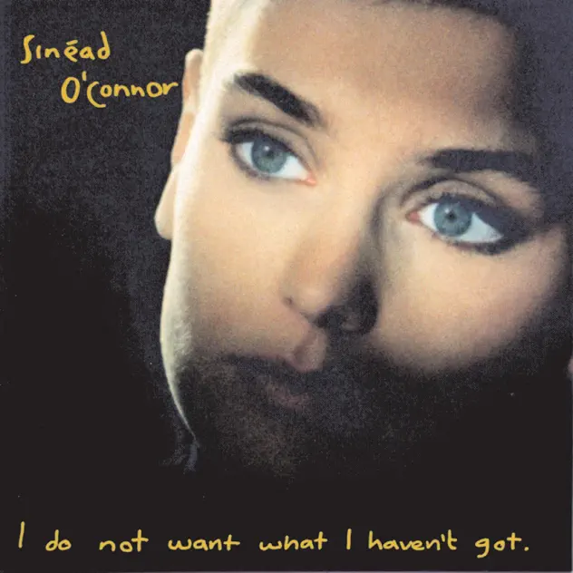

## *I Do Not Want What I Haven't Got* (Sinéad O'Connor, 1990)

  
([Apple Music](https://music.apple.com/us/album/i-do-not-want-what-i-havent-got/1629185300), [YouTube Music](https://music.youtube.com/playlist?list=OLAK5uy_lZU86NH2Tc8yXnHlsEH1uDVpK7g76e0cE))

#### Jim

Ok here you go. One of my favourite songs is Prince doing his version (of his song) ‘Nothing Compares’. Was listening to it a few days ago and it prompted me to listen to Sinead O Connor's version. Then I listened to the rest of the album and fell in love with the whole Irish thing. So my choice is Sinead O Connor’s second album "I Do Not Want What I Haven't Got"

#### Pippin

Love it.

Listened to this album earlier this year a couple times!

#### Jim

I tried to put up Princes version of Nothing Compares. It’s the version with Rosie Gaines. I know we don’t do singles but it is great to hear Prince’s original and see what O’Connor did with it.

#### Pippin

<iframe width="560" height="315" src="https://www.youtube.com/embed/gXdv1zYFmtU?si=pt0ErGfe0aTwGVVd" title="YouTube video player" frameborder="0" allow="accelerometer; autoplay; clipboard-write; encrypted-media; gyroscope; picture-in-picture; web-share" referrerpolicy="strict-origin-when-cross-origin" allowfullscreen></iframe>

#### Pippin

Have listened through the album twice now!

Hmmm what to say. It’s pretty good. I think there’s something about how she kind of starts with talk-singing and gradually opens it up over time? Like obviously she has A Major Voice but she doesn’t necessarily want that to distract us from the words. She comes through clearer than most other artists I can think of right now.

Having written that reminds me of Peaches. I saw the The Teaches of Peaches documentary last night and she is similarly about clarity and legibility (no major voice but major clarity! “Rock show! You came to see a rock show! A big gigantic cock show! You came to see it all!”)

Sinéad O’Connor was 24 when this album released. And as far as I understand she wrote it too (other than the obvious cover). Pretty incredible.

Also this from Wikipedia, in 1988 “She painted the logo of the hip hop group Public Enemy on her head to protest the first-ever Best Rap Performance award being conferred off-screen.”

Pretty cool. 😎

#### Mary

She was such a gutsy person and performer. More soon from us! 

#### Mary

And let’s mark Kris Kristofferson’s death with ‘Sunday mornin’ comin’ down’ please. So many great songs

#### Mary

Sinead O’Connor’s ‘I do not want what I haven’t got’. Thanks for the music nudge Pippin, although I have been thinking about this album. The package is superb starting with the album cover photograph of Sinead looking like a punk angel. Before I listened to her I started with Prince’s version of ‘Nothing compares 2 U’ (with Rosie Gaines). I have always loved it and with a bit more jazz listening behind me I was amazed by what a major ensemble he had going with his back up singers and musicians. Rosie Gaines really shines in that back and forth dialogue with Prince. Prince’s phrasing is almost exaggerated (whomever?) with his distinctive timing and then the whole song builds and builds until the saxophone (?) gets into it and all the strands come together. It really is extraordinary and a very great song.

And then we get to Sinead’s album. For me the other songs are overwhelmed by the stature of ‘Nothing compares 2 U’. They are good but what Prince scribbled (apparently he wrote it v fast, 15 minutes?) and she interprets is nothing but iconic. A lot happens in that song!

I was surprised by the arrangement of some of the other songs with such a stress on all those vibrating strings and that undercut for me the purity of her voice and her unstrained emotion as well as her wonderfully conversational phrasing. I also liked the Irish folk/ traditional styling in some of the songs (obviously ‘I am stretched out on your grave’, ‘Three babies’). In fact Three babies has a wonderful sound but I don’t really understand how it happens. It is certainly has a more produced sound but is that the key?  The structure of her songs is strong on repetition of the chorus and sometimes a surprise element at the end (I’m thinking of the wild fiddling at the end of ‘Stretched out on your grave’, the Irish ‘wobble’ in ‘Black boys on mopeds’) but the lyrics can be a touch clunky or squeezed in with the music. A very interesting album to listen to

And we are now in South Yarra listening to Sinead O’Connor singing Danny Boy! I recall my grandfather singing this song with my uncle Leslie accompanying him on the piano accordion. 

He was not as good as Sinead but he put a lot of feeling into it. As kids we liked the grave stuff …

#### Pippin

Listening to it again this morning. I guess it happens to a bunch of albums but maybe none more than this one that one song is seen as The Song and overpowers everything else through sheer recognizability etc. But I really like the rest of it and a bunch of the songs are more “interesting” than nothing compares which is kind of straightforward? A bit one note? It’s a hell of a note though.

Also love the repeated commitment to these really basic (and good) beats in a bunch of songs, more memories of Peaches and what a great beat maker she is.

