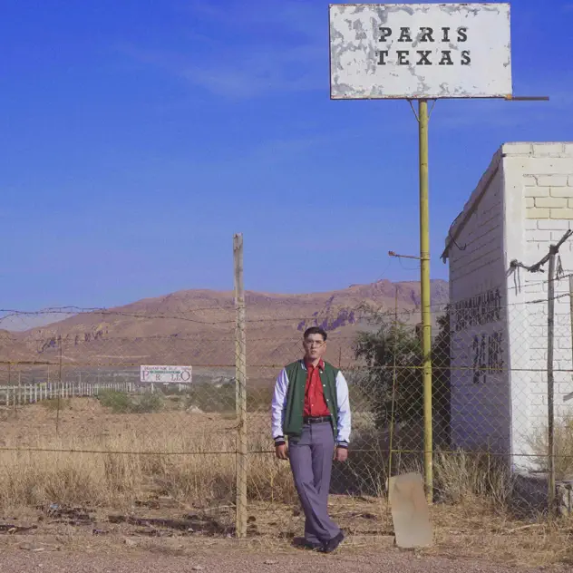

## *Paris Texas* (Kevin Kaarl, 2022)

  
([Apple Music](https://music.apple.com/us/album/paris-texas/1641007429), [YouTube Music](https://music.youtube.com/playlist?list=OLAK5uy_nUMh1iOpuJY1r0YhoQUcgaqr0X5HGe7ls))

#### Pippin

Here’s an easy winner for all of us, given we’re familiar: Kevin Kaarl’s Paris Texas. My thought here is that it’s nice to listen to anyway, but I’m keen to actually sit with the lyrics and the translation to see what he’s actually singing about. And just to appreciate the voice and the whole thing. Might rewatch the Tiny Desk Concert again, too, to re-experience my total shock that he looked so long (and had such a massive head?)

#### Jim

Oh great, we saw the film again earlier this year. The music is terrific…. the film on second viewing not so much as we found out.

