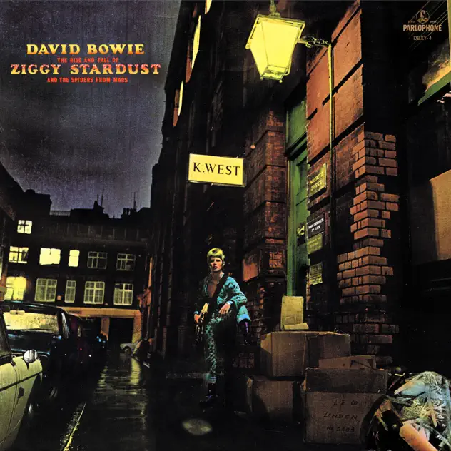

## *The Rise and Fall of Ziggy Stardust and the Spiders from Mars* (David Bowie, 1972)

  
([Apple Music](https://music.apple.com/us/album/the-rise-and-fall-of-ziggy-stardust-and-the/1039796877), [YouTube Music](https://music.youtube.com/playlist?list=OLAK5uy_klxWDedbSRqgjGzYYSvyq3KdHY1wbTt_U))
 
### Pippin

Here we go. My pick is: *The Rise and Fall of Ziggy Stardust and Spiders from Mars* by David Bowie. Not an album I have any real relationship too. I know it's a classic. I like David Bowie on principle but I don't actually listen to him all that much. Effectively I know him more as an actor than as a musician.

So I wanted to listen to one of his albums and this one is, as I understand it, a stone cold classic. So here we are!
