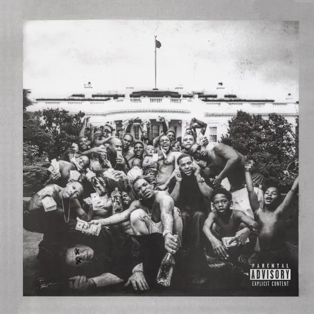

## *To Pimp a Butterfly* (Kendrick Lamar, 2015)

  
([Apple Music](https://music.apple.com/us/album/to-pimp-a-butterfly/1440828886), [YouTube Music](https://music.youtube.com/playlist?list=OLAK5uy_ngCC67DwMYcbMLUBR_QBBvURsEwLllpFY))
 
### Jim

Ok, seeing as how Elton John didn’t die this week I had to resort to some other plan to select my album. Luckily I had my haircut last week and discovered the guy who was doing it was in a band, a rap band. So the other day I went back down to the barbers and asked him what his favourite album was. I have listened to it twice now and from thinking it was sort of ok I am now incredibly impressed and becoming a fan ( a bit late in the day, but there you go). Part of my entry into the world of rap was made easier thanks to the lyrics being available. So the next album for you to get your minds to is: To Pimp a Butterfly by Kendrick Lamar. My fave track at the moment is ‘Complexions’ a song about being black and the way since slavery people have tried to pitch black people against each other by artificially dividing them into different shades of black. But for Lamar they are all “Dark as the midnight hour / Bright as the morning sun” 

### Pippin

I  can safely say I did not see this choice coming.

Have been listening to GNX a few times since it came out, and spent time with Damn. a couple of years ago when I was trying to learn more about hip hop. So this is great! I think I’ve heard To Pimp once or twice over the years but looking forward to listening closely!

### Rilla

Jim is a bit of a fan of Kendrick Lamar. Love it.

### Jim

I’ve now listened to To Pimp my Butterfly six times, four of them with the lyrics showing and the first time and latest one without. I still find rap a bit of a struggle although a lot of the tracks on TPMB feel quite jazz-like, particularly the background sounds but, also some of the phrasing - scat/rap? The thing that really stands out for me is the number of questions Lamar poses. They obviously come from deep anxiety and concern about both the place of black people in American society and his own position as he has become famous, and I assume conflicted, as he tries to be true to himself realising that he has drifted away from earlier friends and what sounds like the criminal street society of his early years. But most of the questions seem to me to reveal a very focussed and analytic mind and he is an amazing storyteller. My two all-time favourite tracks as of now are ‘Hood Politics’ which seems to accuse politicians in DC of the same levels of crime he knew on the streets and ‘Mortal Man’. Best line ‘When shit hits the fan, you still a fan?’ It is so very close to something that used to be said during the Springbok tour demos in ’84. 'When the shit hits the fan, be the fan’ ie spread the bad words of the politicians to infuriate and encourage others to join the battle. And isn’t ‘clutch’ just the best word in the world to describe someone who is doing the right thing. ‘How clutch were the person’

### Pippin

Man, I really like this album. Definitely one of those you can have more in the background because it just sounds good, but also listen to concertedly because it’s musical super interesting and also like reading a series of short stories or something?

I’m writing “morning pages” these days and a lot of it comes out as poems and hearing Kendrick Lamar in full flow is pretty damn inspiring.

No favourite tracks just yet, but a definite liking for the energy of King Kunta. Also For Free? and it’s rapping/singing over straight up jazz. “This dick ain’t free” is a great line.

### Pippin

“i” is also great

### Jim

Totally agree. So interesting to see him as such a champion for mental health. I heard the single on the radio the other day. It felt quite different and doesn’t have that monologue Lamar does on the album. Maybe the album version is from a live performance. Enjoy Rotterdam.

### Mary

KENDRICK LAMAR, PIMP A BUTTERLY
 
I started with the Superbowl half time show which was amazing! He zapped through a lot of songs but it was an easy way to get a simple overview. It was especially interesting to hear / see the anthem style ones like ‘Not like us’ and to pick up on some of the politics especially ’40 acres and a mule’ which repeats across all this work I’ve heard. Plus in the show I really liked the blocked choreography and the (Uniqlo) outfits. It was so made for the TV audience and has got to be a game changer. And then I listened to Pimp a butterfly. I listened with full attention, then I listened with the lyrics, then listened as background and I came out with admiration but not a lot of love! So I grazed through some later stuff and picked up on his enormous cultural clout and range and I liked this more but the stretch from Compton, the role of women, the otherness of where he came from, I felt my self stand apart. But I can’t let it go! Listening at this moment to Luther with Sza – and what genius crazy lyrics and such a pretty tune. My comfort zone! Great choice Jim

### Jim

Even though Lamar got 11 nominations for ‘To Pimp a Butterfly’ in the 2016 Grammy Awards he refused to perform it saying he didn’t want to loose control of the way it was presented in the flashy Award show. Years later at Glastonbury in 2022 he wore a 3 million dollar diamond-encrusted crown of thorns.