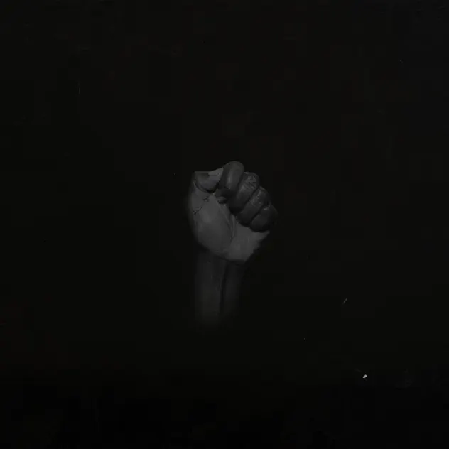

## *Untitled (Black Is)* (Sault, 2020)

  
([Apple Music](https://music.apple.com/us/album/untitled-black-is/1518680087), [YouTube Music](https://www.youtube.com/playlist?list=PLNPGM2D7aODeSGxSkEN0GmzUZLg8wq0ua))

#### Mary

My turn to nominate an album and I go for one from 2020 - Sault’s Untitled {Black Is). It’s labelled as R&B, Soul and Funk and they are a collective and constantly called ‘elusive’, ‘mysterious’ etc.  We have only got part way thru this album so far but is sounding great! Lots of learning underway as I have Neve heard them before. Onwards!!

#### Pippin

“Throughout 2022, after releasing the orchestral instrumental album Air, the collective surprise-released five subsequent studio albums, simultaneously.” — Wikipedia

Including this one, which I’m enjoying on the 480 bus to work.

Also “Between their 2019 debut and late 2023, they had never played a live show, given an interview or released a music video in support of their music”

Quite the sensibility!

#### Pippin

I really hear Gnarls Barkley when I listen to Wildfires, which seems to be their hit on this album. I think it’s the progression of the bass. Definitely a good thing.

#### Jim

A few quick thoughts on the Sault album. So interesting having it follow Sinéad’s, both so intensely political and yet at such different temperatures. Mary was playing the album so heard it through a few times and then went to specific tracks on headphones. I liked the was Sault perform as though it is like you are overhearing them, like sitting next to someone interesting in a coffee bar perhaps. For me it has the effect of putting the music into another space. As you know I’m a sucker for a good Anthem so loved the track Eternal Life. It has a slight fairground feel to it but the words, like most of the album, are pretty intense. ‘I can’t tell if you are alive or dead’ speaks volumes to the indigenous cry of not being seen.

#### Pippin

Listened to a couple of other Sault albums to compare. Particular liked Untitled (Rise) which came out in 2020 along with (Black Is). Very good, in the same vein. Love the drums about halfway through the first track. Checked out 11 as well, from their FIVE album spree in 2022, but that one didn’t really do it for me.

Overall just so interesting the sheer bulk of songs being put out there, the opposite of teasing with singles and gradual release. A torrent instead that feels like it has something very different to say about creativity and the value of making and releasing songs.

#### Mary

So we listened to this album a few times as almost background. We were doing other things and the pace and sound were great. And then I listened to the whole album checking out the lyrics and realised I had no idea what it was abou. The album art of a black power fist should have tipped me off. This is radical political music from the UK where they know what Marxism is. The aspect that really surprised me though was the religiosity of the lyrics which was amplified by black religious music styles esp. Gospel. (e.g. in ‘Hard life’ the message is ‘everything is going to be alright because god is on your side’)

The tracks were generally short and once I got about half-way through I could see the patterns more easily. The chanting of lyrics (‘still won’t put down the gun’), strong choruses in almost anthem mode and the weaving together of overlapping lyrical and musical themes moving in some places into an almost formal ‘call and respond’ (Stop Dem’). And Sault are not afraid of repetition! A major way we move through a song, sometimes with minute shifts and sometimes not.

I liked the way they do lyrics too using everyday words and phrases and then stretching and repeating them until they didn’t sound like lyrics anymore but like media or conversations and the music almost incidental.

The voice of the female singer is great although I was not as keen on her monologues. This is complex music although I don’t have enough musical reference points to pick many of them up (apart from R&B and Gospel but it seems there are a lot! (Wikipedia says so:  British music collective that make a mixture of R&B, urban contemporary gospel, house and disco). In ‘Sorry isn’t enough’ I swear I heard a touch of the music in Marat/Sade!

The instruments kind of defeated me. I guess it is all keyboards, synthesisers  and drum machines -- note that I don’t really know the difference between a synthesizer and a keyboard -- but I also heard a sax, a harmonica, guitars  and what honestly seemed like a hurdy-gurdy. In addition, it felt very processed (both voices and music) at times, to great effect. And in ‘Black’ I heard a strange instrument in the background that I have no clue about. It’s a simple sound but that’s as far as I could get.

Towards the end of the album some of the themes reached an extreme e.g. On June Child where the other thing is fragmentary, interference, cut off voices, a rolling drum machine. It’s short and sharp but pulls together previous songs for me. In sum, I really liked the variety of the way they do things, I liked the dance-ness of it, I liked the use of voices and I really liked the repetitive structures. I will listen to more

#### Pippin

 Hurdy gurdy! Great term. Too much here to actually respond to but interesting to specifically try pick instruments like that - haven’t tried it. I do think the thing that stops out for me is the groove of the drums paired with the very intense lyrics yeah
 
 Separately we saw these guys on Friday
 
 [https://music.apple.com/ca/album/poetry/1720805136?l=fr-CA](https://music.apple.com/ca/album/poetry/1720805136?l=fr-CA)